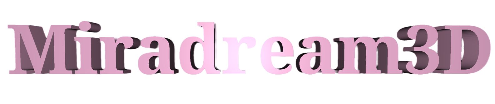
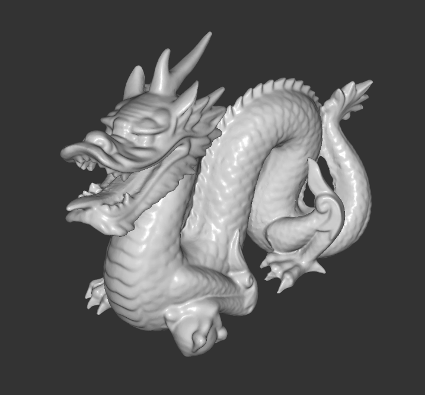
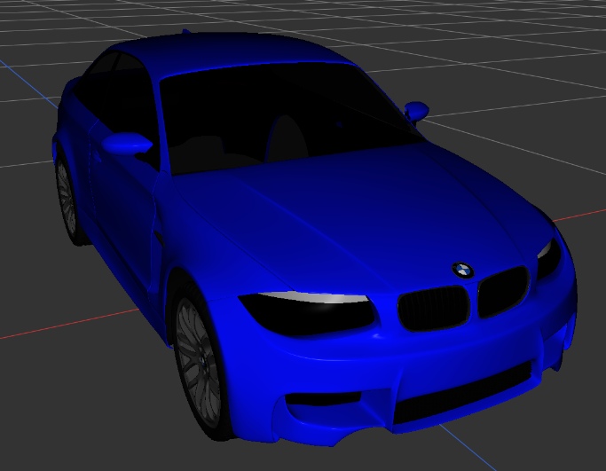
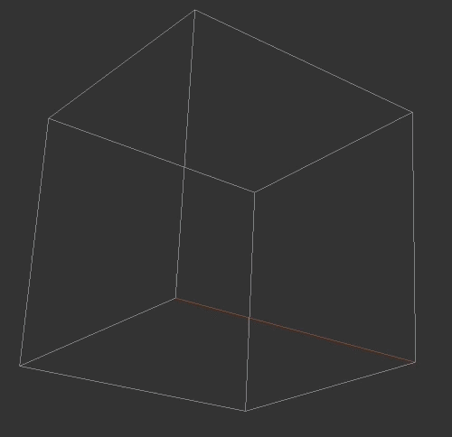
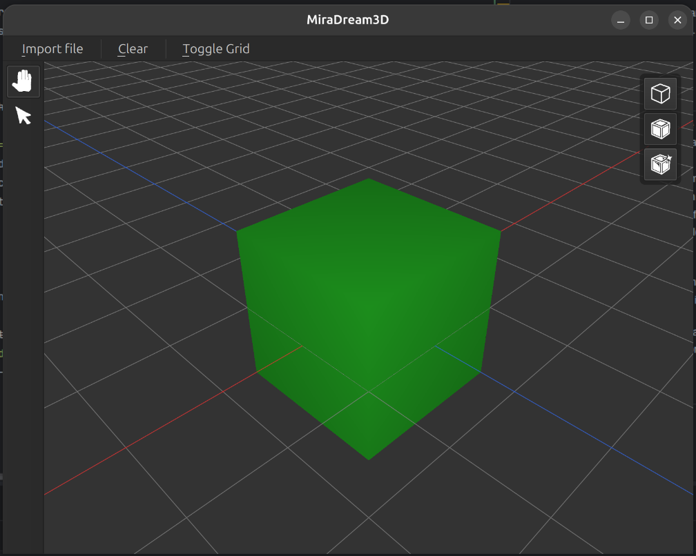
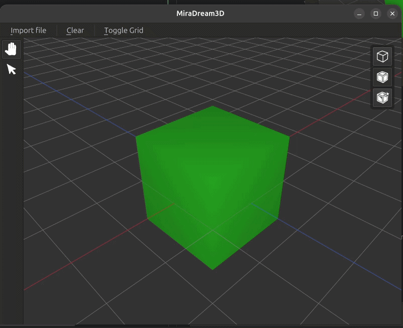

<p align="center">
    
</p>

***

Miradream3D is a custom-built
3D model viewer and interactive workspace application.
It combines native C++ and OpenGL rendering with a Qt-powered interface.

## Real-time rendering

<p align="center">
    
</p>

[Model source](https://casual-effects.com/g3d/data10/common/model/crytek_sponza/sponza.zip)

Miradream is capable of real-time rendering, with user-controller camera movement.
Scenes can be viewed in [wireframe](https://en.wikipedia.org/wiki/Wire-frame_model), solid or material mode.

## A few other examples rendered with MiraDream
<table align="center" width="100%">
  <tr>
    <td align="center" width="46%">
      
    </td>
    <td align="center" width="54%">
      
    </td>
  </tr>
  <tr>
    <td align="center"><b><a href="https://casual-effects.com/g3d/data10/research/model/dragon/dragon.zip">Chinese Dragon</a></b>
    <br><span><i>Triangle count: 871 306</i></span>
</td>
    <td align="center"><b><a href="https://casual-effects.com/g3d/data10/research/model/bmw/bmw.zip">BMW Car</a></b>
    <br><span><i>Triangle count: 385 079</i></span>  
</td>
</tr>
</table>


## Imports

[OBJ files](https://en.wikipedia.org/wiki/Wavefront_.obj_file) along with corresponding
[MTL files](https://fr.wikipedia.org/wiki/Material_Template_Library) can be imported through a custom-made lexer and parser.

Vertices, Faces as well as Normal and Texture coordinates can be imported from OBJ files.
Materials can be defined as well, along with [texture mapping](https://en.wikipedia.org/wiki/Texture_mapping).

The engine supports any triangle and quad, but not n-gons

## Normal generation

<table align="center" width="100%">
  <tr>
    <td align="left" width="50%" style="vertical-align: top; padding-right: 20px;">
      A model can be viewed by the program with as little data as vertex positions and face indices.<br><br>
      Normals are automatically computed using a <a href="https://en.wikipedia.org/wiki/Doubly_connected_edge_list">half-edge data structure</a> along with convexity-properties, 
    which gives us the "outside" of the mesh (it needs to be known, else the mesh would be inside-out, and unlit).

The user can still specify normals. Said computed normals are used as fall-back in case they are missing. 

        
The data structures are generated once on import for faster real-time computation.
</td>
    <td align="center" width="50%" style="vertical-align: middle;">
      
        <br><span> <i>Half-edge data structure traversal</i></span>  
    </td>
  </tr>
</table>


## Interface
<p align="center">

</p>

This is what you see upon opening the software. As you can well imagine, the iconic green cube is present.

### Features include:
- File import (OBJ)
- Navigate tool
- Selection Tool
- Hiding / Showing 2D grid plane
- Viewport mode selection : Wireframe, Solid, Material (descending)


## Selection & Moving
This feature is work-in-progress.

The software currently generates a picking buffer for vertices, which can be clicked and highlighted.
<p align="center">
    
</p>


## Doxygen Documentation
A doxygen documentation is available for MiraDream3D:
```bash
doxygen doc/Doxyfile
open doc/build/html/index.html
```

## Prerequisites

Before building the project, ensure you have the following tools and libraries installed:
* **C++ Compiler**: A modern compiler supporting C++17 (such as GCC, Clang, or MSVC).
* **CMake**: Version 3.16 or higher.
* **Qt SDK**: Qt 6 development packages.

Works on Linux, Windows and macOS.


## Build Instructions

Clone the repository and compile the project using CMake:

1. **Clone the repo:**
   ```bash
   git clone https://github.com/jassoka/MiraDream3D.git
   cd MiraDream3D
   ```
2. **Create and enter a build directory:**
    ```bash
   mkdir build && cd build
    ```

3. **Configure the project with CMake:** \
*(If Qt is not installed in your system's default path, 
specify your Qt directory using CMAKE_PREFIX_PATH)*
    ```bash
   cmake -DCMAKE_PREFIX_PATH=/path/to/your/qt/lib/cmake ..
    ```
   
4. **Compile:**
    ```bash
   cmake --build . --config Release
    ```

Once built successfully, you can find the executable inside your build directory


## Credits

This project makes use of the following third-party components:

* **[GLM](https://github.com/g-truc/glm)** - OpenGL Mathematics (GLM)

## License

Copyright (c) 2026 Jassoka, Tatatumeur

This project is licensed under the [MIT License](LICENSE) - see the `LICENSE` file for details.
